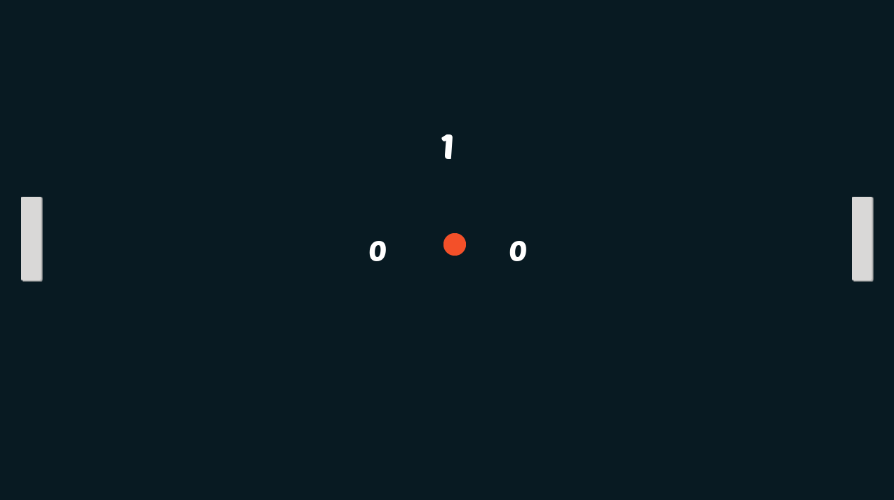

# Pong

Pong is a popular 2d game that I will remake to improve my Godot skills with game dev. Hope you like it!
This project is part of the things I learned from  [Clear Code - Learn Godot by creating Pong](https://www.youtube.com/watch?v=kr1BoEbuveI), a really good tutorial that gave me the introduction to Godot Engine. In my project I added some things by myself and made some changes like:
+ Game Over Screen

>## Technologies
+ Godot Engine
+ GDScript

<br>

## Game Screenshot 


>## In this game I learned important basic concepts like:
+ Collisions
+ Labels
+ GDScript programming
+ Sounds in the game
+ Game Over
+ Basic AI
+ Player motion 

## How to Download (Windows)
### First Way
```
$ 1 - Donwload the repository clickin in "Code -> Download Zip"
$ 2 - Extract the .zip file and open the "build" folder, where are the executable file and the package file that is important to run the game
$ 3 - Run the Pong.exe
```
### Second Way

``` 
1 - Use:
$ git clone https://github.com/alex-custodio/Pong.git

2 - Open the "build" folder in your file explorer, where are the executable file and the package file that is important to run the game

3 - Run the Pong.exe
```


